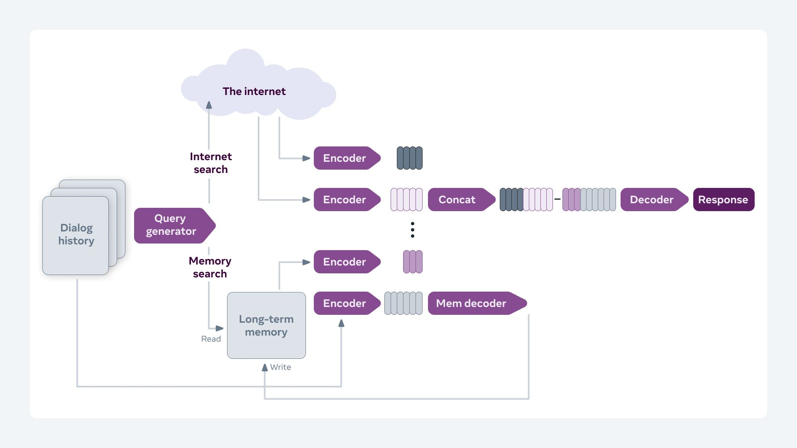

# BlenderBot 2.0

> July 16, 2021
Facebook Research
> 

## What is BlenderBot 2.0

<aside>
💡 A chatbot with **its own long-term memory** and **the ability to access the internet**.

</aside>

ParlAI 공식 문서에 소개된 BlenderBot 2.0을 소개하는 첫번째 문장이다. 문장 그대로 자신만의 고유한 long-term memory 가지고, 인터넷에 접근할 수 있는 능력을 가진 파워풀한 챗봇이다.

## Model Architecture

기존에 고도화된 챗봇(Google의 Meena, Facebook의 BlenderBot)과 비교했을 때 BlenderBot 2.0이 가진 차별점은 위에서 설명했듯 Internet Search와 Long-term Memory 부분이다.

위 그림은 모델 전체적인 구조를 나타낸 그림으로 다음과 같은 흐름을 통해 챗봇은 응답을 생성한다.

먼저 지금까지의 나눈 대화를 기반으로 Query Generator를 통해 쿼리를 생성한다. 이렇게 생성된 쿼리는 Internet Search API를 통해 인터넷에서 쿼리에 대한 검색 결과 후보를 K개 뽑아오고, Long-term memory에서도 쿼리에 해당하는 후보를 N개 뽑아온다. 이렇게 생성된 후보를 생성 모델(seq2seq 같은)의 인코더를 통해 인코딩된 벡터를 생성하고, 생성된 벡터를 모두 연결(Concatenate)한다. 연결된 벡터를 디코더를 통과시켜 대화에 적절한 응답(Response)를 생성하게 된다.

## Related Papers

- [Internet-Augmented Dialogue Generation](https://parl.ai/projects/sea). Mojtaba Komeili, Kurt Shuster, Jason Weston.
    - 위에서 소개한 BlenderBot 2.0의 두 가지 특징 중 인터넷에 접근할 수 있는 능력에 대한논문
    - 사용자와 대화하면서 쿼리를 생성하고, 생성된 쿼리를 API를 통해 가능한 후보군(Candidates)을 뽑아서 대화에 필요한 응답을 생성하는데 사용한다.
- [Beyond Goldfish Memory: Long-Term Open-Domain Conversation](https://parl.ai/projects/msc). Jing Xu, Arthur Szlam, Jason Weston.
    - 위에서 소개한 BlenderBot 2.0의 두 가지 특징 중 long-term memory에 관한 논문
    - 기존의 챗봇에 사용된 모델들이나 방법론들은 짧은 대화 데이터를 기반으로 학습되었고, 이로 인해 긴 대화가 진행되면서 이전에 나눴던 대화의 정보들을 기억하지 못하는 문제가 발생한다. 이를 **Goldfish Memory**라고 칭하며 이를 해결하기 위해 저자들이 두 가지 방법으로 **새로운 데이터셋 제작**과 **대화를 요약하여 사용하는 방법론**을 소개한다.

---

# Beyond Goldfish Memory

BlenderBot 2.0의 특징 중 하나인 long-term memory에 관해 소개하는 논문으로, 논문의 두 가지 핵심 키워드는 아래와 같다.

- 높은 퀄리티와 긴 대화 길이를 갖는 Multi-Session Chat(MSC) 데이터셋
- MSC를 위한 모델링 방법

## Multi-Session Chat

챗봇 고도화를 위한 대화 데이터셋의 퀄리티와 양이 점점 증가하고 있으나, 아직까지 현존하는 데이터셋들과 챗봇을 위한 SOTA 모델들이 놓치고 있는 부분은 대부분의 사람들이 하는 대화는 오랜 시간 동안 진행된다는 점이다.

그러나 Human Resource의 부족으로 긴 대화에 대한 데이터는 충분하지 않고 평균적으로 2~15번 정도의 대화를 주고 받는 단일 대화로 구성되어있다. 이러한 이유로 대부분의 Dialogue task에서 SOTA 모델들(Google의 Meena, Facebook의 BlenderBot)은 토큰 시퀀스의 길이를 128로 제한하여 사용하는데, 이런 환경이 긴 대화나 여러 차례에 걸친 대화에서 좋은 성능을 보일지는 확실치 않다.

이를 위해 논문의 저자들은 최대 5번에 걸쳐서 최대 14번의 대화를 주고 받는 데이터셋인 **Multi-Session Chat(MSC)**을 만들었다. MSC 데이터셋의 특징은 아래와 같다.

1. 데이터셋 제작에 참여하는 참가자들은 각자 역할(Persona)가 주어진다. 이러한 방법은 참가자들이 주어진 역할을 수행하기 위해 다양한 대화를 시도하고, 또 참가자들의 개인정보가 노출되는 문제를 방지한다. 검증 데이터셋과 테스트 데이터셋에는 학습 데이터셋에서 적어도 한 번 이상 등장한 역할이 사용되었고 총 1,155개의 역할(Personas)이 사용되었다.
2. 참가자들은 대화 프로그램을 사용하여 서로 대화를 하는데 한 차례의 대화를 나누는 것을 세션(Session)이라고 한다. 참가자들은 상대방과 최대 5번에 걸쳐 세션에 참가한다. 이 때 세션 사이의 간격은 1~7시간 혹은 1~7일을 갖는다. 즉, A와 B가 한 번 대화를 나눈 뒤(세션) 1~7시간 혹은 1~7일 뒤에 다시 대화를 나누게 된다.
3. 이 때 참가자들은 이전 세션의 대화를 확인할 수 있지만 대화가 길어질수록 제한된 시간 내에 읽고 이를 활용하는 것이 힘들기 때문에, 첫번째 세션 이후부터는 세션에서 발생한 대화의 요점을 요약하여 다음 세션에서 이를 확인할 수 있도록 표시한다. 이러한 방법은 이전 세션에서 각 화자의 요점을 요약했기 때문에 이를 바탕으로 주어진 역할을 더 확장하거나 더 깊은 개성을 표현하는 것도 기대할 수 있다.

## Modeling

- **Encoder-Decoder Transformer**

현재 open-domain dialouge task에서 정형화된 방법은 Google의 Meena에서 사용한 것과 같이 Encoder-Decoder Transformer를 사용하거나 BlednerBot system 같이 큰 언어 모델을 사용하는 것이다.

위와 같이 Encoder와 Decoder를 갖는 Seq2Seq 모델을 사용하여 대화를 Encoder의 입력으로 사용하고 Docoder를 통해 대화에 대한 응답을 생성하는 방법을 기반으로 동작한다.

그러나 이러한 기본적인 Encoder-Decoder Transformer을 사용한 방법론에는 뚜렷한 한계점이 존재한다. 바로 학습 데이터에 의존적이다는 것이다. 모델이 학습 데이터에 근거하여 응답을 생성하는 방법을 학습하기 때문에 학습 데이터에는 존재하지 않거나 다른 도메인적인 특성을 가진 데이터에 대해 나쁜 결과를 생성하는 결정적인 문제점이 존재한다.

- **Retrieval-Augmentation**

이러한 문제점을 해결하기 위해 RAG, FiD 같은 Retrieval-augmentation이라는 방법론이 제안되었다. Retrieval-augmentation은 인코더를 통과시킬 입력 시퀀스를 Retriever를 사용하여 찾아낸 뒤 모델의 출력을 생성하는 방법론이다.

ElasticSearch나 FAISS와 같은 검색엔진을 사용하여 입력 쿼리에 적합한 Context들을 찾아내고 이를 함께 사용해 인코더와 디코더를 통과시켜 응답을 생성한다. 예를 들어, 위키피디아 덤프 파일을 ElasticSearch에 인덱싱(저장)한다. 그리고 나서 "대한민국의 수도는 어디인가요?라는 입력 시퀀스가 주어진다면, 이를 검색엔진을 통해 관련된 contexts를 뽑고 이를 같이 모델 인코더의 입력 시퀀스로 사용하여 결과를 뽑아낸다.

- **Summarization Memory-Augmentation**

위에서 이야기한 Retrieval-Augmentation에서 확장된 방법론으로, Retrieval-augmentation을 MSC 데이터에 대해 적용할 경우 대화의 히스토리를 메모리에 저장하고 검색하여 context로 사용한다. 그러나 이런 방법은 아래와 같은 두 가지 단점이 존재한다.

1. 저장해야하는 Context가 너무 방대하고, 그 방대한 Context에서 검색을 수행해야 한다.
2. 해당 Context(대화 히스토리)에 별도의 처리가 되어있지 않기 때문에 모델이 해당 Context에서 필요한 정보를 추출하고 이를 취합하는 등의 많은 작업을 감당하게 된다.

이를 해결하기 위해 논문에서는 Context에서 지식을 뽑아내 요약을 생성하는 **Memory-Augmentation** 방법론을 제시했다. Memory-augmentation은 두 가지 구성요소를 가진다.

1. **An Encoder-Decoder Abstractive Summarizer** : 대화를 요약하는 모델로 대화 히스토리를 입력 받아 해당 대화 히스토리에 대한 요약을 생성한다. 생성된 요약이 Long-term memory에 저장할지에 대한 여부도 결정한다. 해당 모델은 MSC 데이터셋에서 제공하는 요약 데이터를 사용하여 Supervised Learning으로 학습이 가능하다.
2. **A Memory-Augmented Generator** : 대화 히스토리를 받아 Long-term memory에 접근하여 알맞은 응답(Response)를 생성하는 모델이다. 해당 모델은 메모리에서 검색하고 적절한 응답을 생성하기 위해 Retrieval-augmentation 모델을 사용 가능하다.

해당 방법론을 사용했을 때 추가적인 이점은 대화 히스토리의 길이가 길기 때문에 모델의 제한된 토큰 시퀀스 최대 길이를 초과하는 경우 잘리는 문제를 해소할 수 있다는 점이다.

## Benchmarks

---

# References

### BlenderBot 2.0

- [BlenderBot 2.0 article in ParlAI](https://parl.ai/projects/blenderbot2/)
- [BlenderBot 2.0 article in Facebook AI](https://ai.facebook.com/blog/blender-bot-2-an-open-source-chatbot-that-builds-long-term-memory-and-searches-the-internet)
- [BlenderBot 2.0 korean Review article](https://brunch.co.kr/@advisor/38)

### Beyond Goldfish Memory

- [Retrieval Augmented Generation artical in Facebook AI](https://ai.facebook.com/blog/retrieval-augmented-generation-streamlining-the-creation-of-intelligent-natural-language-processing-models/) : Retrieval-Augmentation 관련된 Facebook AI 공식 아티클
- [Paper - Fusion in Docoder](https://arxiv.org/pdf/2007.01282.pdf) : Retrieval-Augmentation 모델 중 하나로 사용된 Fusion-in-Decoder(FiD) 논문